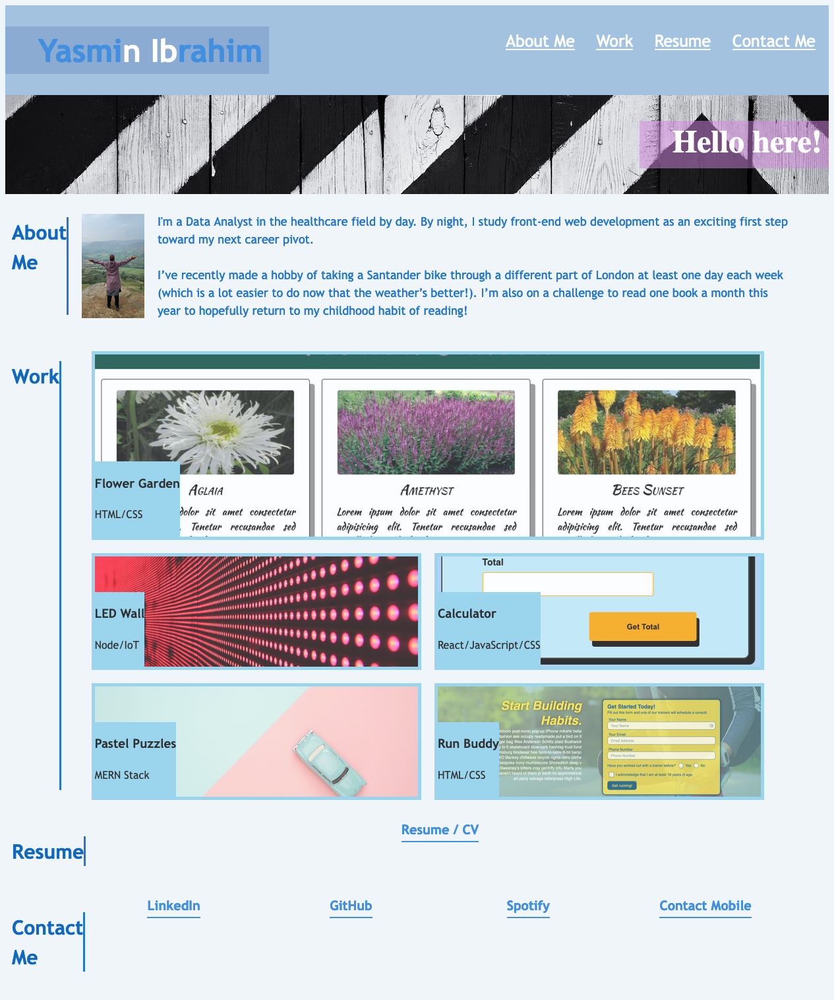

# Module 2 Challenge

## Description 

This project involved building a portfolio page, by using the skills acquired in the first and second modules.

## Table of Contents (Optional)

* [Installation](#installation)
* [Usage](#usage)
* [Credits](#credits)
* [License](#license)
* [Badges](#badges)
* [Features](#features)
* [Contributing](#contributing)

## Installation
<br>

1. Navigate to the repository using the link below: 

```sh
   https://github.com/yasmiinLDN/challenge-2-Portfolio
   ```
<br>

2. Click the green "< > Code" button to copy the SSH key related to the repository
<br>
<br>
<br>
3. Clone the repository into your local machine using the below command entered into the command line (assuming you have set up your SSH connection correctly to connect your GitHub account to your local machine):

```sh
   git clone git@github.com:yasmiinLDN/challenge-2-Portfolio.git
   ```
<br>


## Usage 

Below shows the layout of the final website:




## Credits

This document was created with assistance from the following websites:

https://w3schools.com/
<br>
https://flexboxfroggy.com/
<br>
https://cssgridgarden.com/
<br>
https://codepen.io/crbecker1/pen/RwWvMGM
<br>
https://css-tricks.com/snippets/css/a-guide-to-flexbox/#aa-order
<br>
https://codepen.io/karks88/pen/eWWaPg?editors=1100


## License

This document is distributed under the MIT License. Please see LICENSE.txt for more information.

## Badges

| HTML5            |    

| CSS            |  


## Features

### Main website contents
- About me
- My work projects (including two previous projects)
- Resume
- Contact information

## Contributing

  

